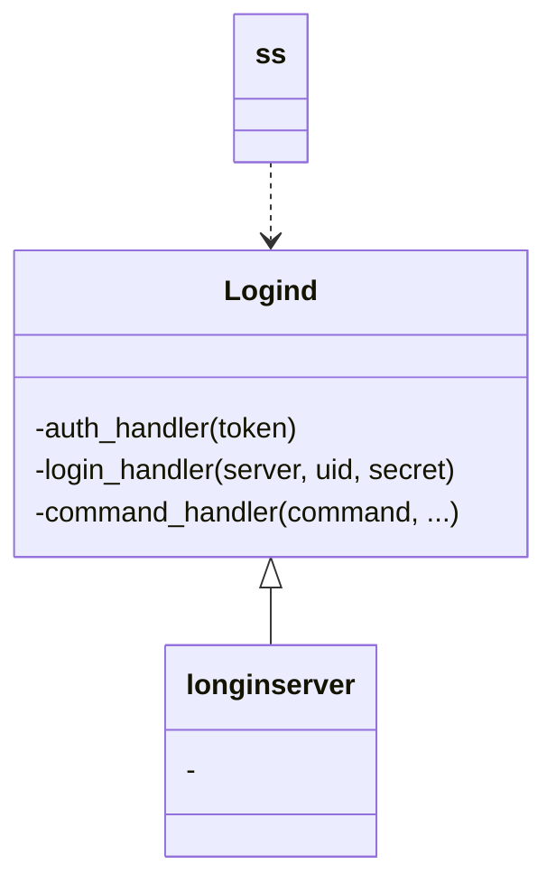

# Skynet案例1：Login

1. 安装skynet，安装必要的库，进入目录执行`make linux`。

2. 执行如下命令，可以打开案例中的登陆服
   
   ```
   liaozuojia@DESKTOP-OUVU5AG:/mnt/d/UbuntuProjects/skynet$ ./skynet examples/config.login
   [:00000002] LAUNCH snlua bootstrap
   [:00000003] LAUNCH snlua launcher
   [:00000004] LAUNCH snlua cdummy
   [:00000005] LAUNCH harbor 0 4
   [:00000006] LAUNCH snlua datacenterd
   [:00000007] LAUNCH snlua service_mgr
   [:00000008] LAUNCH snlua main
   [:00000009] LAUNCH snlua logind
   [:0000000a] LAUNCH snlua logind
   [:0000000b] LAUNCH snlua logind
   [:0000000c] LAUNCH snlua logind
   [:0000000d] LAUNCH snlua logind
   [:0000000e] LAUNCH snlua logind
   [:0000000f] LAUNCH snlua logind
   [:00000010] LAUNCH snlua logind
   [:00000011] LAUNCH snlua logind
   [:00000009] login server listen at : 127.0.0.1 8001
   [:00000012] LAUNCH snlua gated 9
   [:00000012] Listen on 0.0.0.0:8888
   [:00000002] KILL self
   ```

3. 类图



## longinserver

```
local server = {
    host = "127.0.0.1",
    port = 8001,
    multilogin = false,    -- disallow multilogin
    name = "login_master",
}
```

先看一段代码：

```lua
local function login(conf)
    local name = "." .. (conf.name or "login")
    skynet.start(function()
        local loginmaster = skynet.localname(name)
        if loginmaster then
            local auth_handler = assert(conf.auth_handler)
            launch_master = nil
            conf = nil
            launch_slave(auth_handler)
        else
            launch_slave = nil
            conf.auth_handler = nil
            assert(conf.login_handler)
            assert(conf.command_handler)
            skynet.register(name)
            launch_master(conf)
        end
    end)
end
```

可以看到在当这个函数调用时，`skynet.localname`判断了这个`name`的节点是否存在（案例中是`login_master`），如果不存在，是以**master**启动，存在的话是启动一个新的作为**slave**，完成多登陆节点的创建。

可以发现**master**节点不需要`auth_handler`，slave节点只需要`auth_handler`，将无关的函数置空了，这里初步思考：在每次调用`skynet.newservice`时，都创建了一个新的lua虚拟机。

### loginserver主节点：local function launch_master(conf)

```lua
local function launch_master(conf)
    --先读取了conf中的配置项
    local instance = conf.instance or 8
    assert(instance > 0)
    local host = conf.host or "0.0.0.0"
    local port = assert(tonumber(conf.port))
    local slave = {}
    local balance = 1
    --将这个loginserver节点的lua消息派发给conf.command_handler
    skynet.dispatch("lua", function(_,source,command, ...)
        skynet.ret(skynet.pack(conf.command_handler(command, ...)))
    end)
    --根据instance值创建子节点
    for i=1,instance do
        table.insert(slave, skynet.newservice(SERVICE_NAME))
    end
    --开启socket监听
    --以下使用闭包的域写法，每调用一次launch_master都会创建一套launch_master的闭包
    --其中的balance和slave都是存在这一层闭包中的，外部无法轻易访问
    skynet.error(string.format("login server listen at : %s %d", host, port))
    local id = socket.listen(host, port)
    socket.start(id , function(fd, addr)
        local s = slave[balance]
        balance = balance + 1
        if balance > #slave then
            balance = 1
        end
        local ok, err = pcall(accept, conf, s, fd, addr)--将连接消息均衡派发给slave子节点
        if not ok then
            if err ~= socket_error then
                skynet.error(string.format("invalid client (fd = %d) error = %s", fd, err))
            end
        end
        socket.close_fd(fd)    -- We haven't call socket.start, so use socket.close_fd rather than socket.close.
    end)
end
```

以上可以看出代码是很精悍的完成了master节点的工作，结合语言特性，外界无法访问master中的这些变量。

### loginserver子节点：local function launch_slave(auth_handler)

```lua
local function launch_slave(auth_handler)
    local function auth(fd, addr)--认证函数
        -- set socket buffer limit (8K)
        -- If the attacker send large package, close the socket
        socket.limit(fd, 8192)

        local challenge = crypt.randomkey()
        write("auth", fd, crypt.base64encode(challenge).."\n")

        local handshake = assert_socket("auth", socket.readline(fd), fd)
        local clientkey = crypt.base64decode(handshake)
        if #clientkey ~= 8 then
            error "Invalid client key"
        end
        local serverkey = crypt.randomkey()
        write("auth", fd, crypt.base64encode(crypt.dhexchange(serverkey)).."\n")

        local secret = crypt.dhsecret(clientkey, serverkey)

        local response = assert_socket("auth", socket.readline(fd), fd)
        local hmac = crypt.hmac64(challenge, secret)

        if hmac ~= crypt.base64decode(response) then
            error "challenge failed"
        end

        local etoken = assert_socket("auth", socket.readline(fd),fd)

        local token = crypt.desdecode(secret, crypt.base64decode(etoken))
        --一大堆认证操作做完
        --调用传进来的函数，把token返回了
        local ok, server, uid =  pcall(auth_handler,token)

        return ok, server, uid, secret
    end

    local function ret_pack(ok, err, ...)
        if ok then
            return skynet.pack(err, ...)
        else
            if err == socket_error then
                return skynet.pack(nil, "socket error")
            else
                return skynet.pack(false, err)
            end
        end
    end

    local function auth_fd(fd, addr)
        skynet.error(string.format("connect from %s (fd = %d)", addr, fd))
        socket.start(fd)    -- may raise error here
        local msg, len = ret_pack(pcall(auth, fd, addr))
        socket.abandon(fd)    -- never raise error here
        return msg, len
    end
    -- slave节点的lua消息调度
    skynet.dispatch("lua", function(_,_,...)
        local ok, msg, len = pcall(auth_fd, ...)
        if ok then
            skynet.ret(msg,len)
        else
            skynet.ret(skynet.pack(false, msg))
        end
    end)
end
```

其中slave节点只接受一种类型的消息，就是带账号密码的验证消息，所以当收到`lua`消息时，直接调用了`auth_fd`。

## logind

现在回头看`main.lua`中调用的`local loginserver = skynet.newservice("logind")`。

一开始初始化了一个叫`server`的表，最终调用require("snax.loginserver")(server)，即**server**就是**loginserver**代码中用到的`conf`。

所以先简单在longinserver中找到被使用的域：

```lua
local conf = {
    name = "", -- 登陆节点名称
    multilogin = false, -- 是否允许重复登录
    instance = 8, -- slave节点数量
    host = "0.0.0.0", -- 登陆节点socket ip
    port = 9001, --登陆节点socket 端口号
}
---验证账号密码等内容，返回值理论上是需要根据实际情况修改的
conf.login_hander = function(server, uid, secret) end -- master
conf.command_handler = function(command, ...) end -- master
--- 解析token
conf.auth_handler = function(token) end -- slave
```

## 走一遍登陆流程

1. master节点中开启的socket：由`launch_master`函数中的`socket.start`中第二个闭包函数调用`accept`：
   
   ```lua
   socket.start(id, function(df, addr)
       local s = slave[balance] 
       balance = balance + 1 
       if balance > #slave then 
           balance = 1 
       end 
       local ok, err = pcall(accept, conf, s, fd, addr) 
       if not ok then 
           if err ~= socket_error then 
           skynet.error(string.format("invalid client (fd = %d) error = %s", fd, err)) 
       end 
   end
   ```

2. 在`accept`函数中通过slave节点中调用`skynet.dispatch`转发的lua类型消息直接调用`auth_fd`。

3. `auth_fd`调用到`auth`，和客户端进行交互，解码得到此次的**token**，调用`conf.auth_handler`。

4. `auth_handler`中进行解码，**token**中包含的数据内容是可自定义的，主要看客户端传了什么。
   
   接着可以在这里验证账号密码的合理性。
   
   ```lua
   function conf.auth_handler(token)
       -- the token is base64(user)@base64(server):base64(password)
       local user, server, password = token:match("([^@]+)@([^:]+):(.+)")
       user = crypt.base64decode(user)
       server = crypt.base64decode(server)
       password = crypt.base64decode(password)
       assert(password == "password", "Invalid password")
       return server, user
   end
   ```
   
   `auth_handler`的结果主要分成功和失败，但最终都会回到第二步的`accept`函数中。

5. 在accept中继续向下，执行最后会调用`conf.login_handler`，并返回200代表登陆成功。

---

然而在conf.login_handler中，会通知具体的游戏节点“玩家已经进入游戏了”。所以当我们没有向登陆服注册Game节点的时候是会出现问题的。

接下来就是下一篇的事情了
