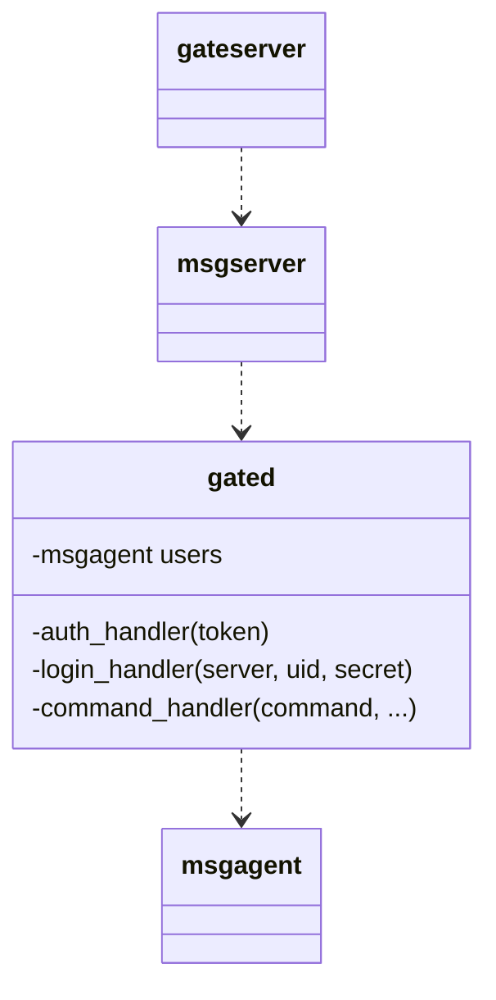

# Skynet案例2：Game

以下开始讲`local gate = skynet.newservice("gated", loginserver)`开启游戏服务器的流程。



## msgserver

```lua
function server.start(conf)
    local expired_number = conf.expired_number or 128

    local handler = {}

    local CMD = {
        login = assert(conf.login_handler),
        logout = assert(conf.logout_handler),
        kick = assert(conf.kick_handler),
    }

    function handler.command(cmd, source, ...) ... end
    function handler.open(source, gateconf) ... end
    function handler.connect(fd, addr) ... end
    function handler.disconnect(fd) ... end
    handler.error = handler.disconnect

    -- atomic , no yield
    local function do_auth(fd, message, addr) ... end
    local function auth(fd, addr, msg, sz) ... end
    local request_handler = assert(conf.request_handler)

    -- u.response is a struct { return_fd , response, version, index }
    local function retire_response(u) ... end
    local function do_request(fd, message) ... end
    local function request(fd, msg, sz) ... end
    function handler.message(fd, msg, sz) ... end
    return gateserver.start(handler)
end
```

先不用看具体逻辑，可以这个函数在最后又调用了`gateserver.start`函数

```lua
function gateserver.start(handler)
    assert(handler.message)
    assert(handler.connect)

    function CMD.open(source, conf) ... end

    function CMD.close() ... end

    local MSG = {}

    local function dispatch_msg(fd, msg, sz) ... end

    MSG.data = dispatch_msg

    local function dispatch_queue() ... end

    MSG.more = dispatch_queue

    function MSG.open(fd, msg) ... end

    function MSG.close(fd) ... end

    function MSG.error(fd, msg) ... end

    function MSG.warning(fd, size) ... end

    skynet.register_protocol {
        name = "socket",
        id = skynet.PTYPE_SOCKET,    -- PTYPE_SOCKET = 6
        unpack = function ( msg, sz )
            return netpack.filter( queue, msg, sz)
        end,
        dispatch = function (_, _, q, type, ...)
            queue = q
            if type then
                MSG[type](...)
            end
        end
    }

    local function init()
        skynet.dispatch("lua", function (_, address, cmd, ...)
            local f = CMD[cmd]
            if f then
                skynet.ret(skynet.pack(f(address, ...)))
            else
                skynet.ret(skynet.pack(handler.command(cmd, address, ...)))
            end
        end)
    end

    if handler.embed then
        init()
    else
        skynet.start(init)
    end
end
```

---

### gated的lua.open

打开这个game节点向登录服务器注册的流程。

在一开始的`main.lua`脚本中调用`newserver()`创建了gated节点，接着马上`skynet.call(gate, "lua", "open", {  port = 8888,  maxclient = 64,  servername = "sample",})`。

`local function init()`函数对lua消息进行了判断，优先调用`CMD.open()`和`CMD.close()`，从而向下调用，每层都有不同作用。

1. `gateserver`中的`CMD.open()`。**打开socket**。
   
   ```lua
   function CMD.open( source, conf )
       assert(not socket)
       local address = conf.address or "0.0.0.0"
       local port = assert(conf.port)
       maxclient = conf.maxclient or 1024
       nodelay = conf.nodelay
       skynet.error(string.format("Listen on %s:%d", address, port))
       socket = socketdriver.listen(address, port)
       socketdriver.start(socket)--开这个节点的socket连接
       if handler.open then
           return handler.open(source, conf)
       end
   end
   ```

2. `msgserver`中`server.start()`函数创建的闭包中的的`handler.open`。
   
   ```lua
   function handler.open(source, gateconf)
       local servername = assert(gateconf.servername)
       return conf.register_handler(servername)
   end
   ```

3. `gated`中`server.register_handler`。
   
   ```lua
   function server.register_handler(name)
       servername = name
       skynet.call(loginservice, "lua", "register_gate", servername, skynet.self())
   end
   ```
   
   在这里调用了`logind`中的 `CMD.register_gate`。

看下来就是闭包套闭包的疯狂套娃，由于没有智能提示，第一次看感觉十分混乱。

---

### login

1. 基于上一篇的案例——Login模块中，在登陆的最后通知了gameserver玩家登陆。
   
   ```lua
   function server.login_handler(server, uid, secret)
       print(string.format("%s@%s is login, secret is %s", uid, server,     crypt.hexencode(secret)))
       local gameserver = assert(server_list[server], "Unknown server")
       -- only one can login, because disallow multilogin
       local last = user_online[uid]
       if last then
           skynet.call(last.address, "lua", "kick", uid, last.subid)
       end
       if user_online[uid] then
           error(string.format("user %s is already online", uid))
       end
       --在这里开始通知
       local subid = tostring(skynet.call(gameserver, "lua", "login", uid, secret))
       user_online[uid] = { address = gameserver, subid = subid , server = server}
       return subid
   end
   ```

2. `gateserver.lua`：`gateserver.start`函数的`init()`函数闭包中。
   
   ```lua
   local function init()
           skynet.dispatch("lua", function (_, address, cmd, ...)
               local f = CMD[cmd]
               if f then
                   skynet.ret(skynet.pack(f(address, ...)))
               else
                   skynet.ret(skynet.pack(handler.command(cmd, address, ...)))
               end
           end)
       end
   ```

3. `msgserver.lua`：`server.start()`中的`handler.command()`。
   
   ```lua
   local CMD = {
       login = assert(conf.login_handler),
       logout = assert(conf.logout_handler),
       kick = assert(conf.kick_handler),
   }
   
   function handler.command(cmd, source, ...)
       local f = assert(CMD[cmd])
       return f(...)
   end
   ```
   
   可以看到在`msgserver.lua`中显示的声明了`CMD.login`函数

4. `gated.lua`：`function server.login_handler(uid, secret) ... end`。
   
   通过`skynet.newserver "msgagent"`创建了玩家的`agent`
   
   ```lua
   -- login server disallow multi login, so login_handler never be reentry
   -- call by login server
   function server.login_handler(uid, secret)
       if users[uid] then
           error(string.format("%s is already login", uid))
       end
   
       internal_id = internal_id + 1
       local id = internal_id    -- don't use internal_id directly
       local username = msgserver.username(uid, id, servername)
   
       -- you can use a pool to alloc new agent
       local agent = skynet.newservice "msgagent" --创建玩家agent
       local u = {
           username = username,
           agent = agent,
           uid = uid,
           subid = id,
       }
   
       -- trash subid (no used)
       --用户节点初始化，调用登录
       skynet.call(agent, "lua", "login", uid, id, secret)
   
       users[uid] = u
       username_map[username] = u
       --向msgserver注册
       msgserver.login(username, secret)
   
       -- you should return unique subid
       return id
   end
   ```

---

### msgagent.lua

完成了这一步，用户已经登录到了Game节点。

```lua
skynet.start(function()
	-- If you want to fork a work thread , you MUST do it in CMD.login
	skynet.dispatch("lua", function(session, source, command, ...)
		local f = assert(CMD[command])
		skynet.ret(skynet.pack(f(source, ...)))
	end)

	skynet.dispatch("client", function(_,_, msg)
		-- the simple echo service
		skynet.sleep(10)	-- sleep a while
		skynet.ret(msg)
	end)
end)
```

可以看到案例中的是一个简单的回声客户端。
